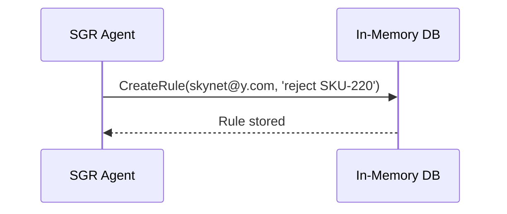

# Schema-Guided Reasoning (SGR): Структурированное руководство

Это руководство систематизирует материал из `sgr_full.md`: описывает подход SGR, основные паттерны, архитектуру агента, примеры кода и практические рекомендации по внедрению. Полный неструктурированный сборник с исходным содержимым статей и кода — в файле `sgr_full.md`.

## Содержание

- Введение и цели
- Базовые понятия SGR
- Минимальный рабочий пример (инструменты + диспетчер)
- Архитектура агента и поток выполнения
- Паттерны SGR (routing, классификация, чек-листы и др.)
- Примеры (support triage, text-to-SQL, найм и др.)
- Тестирование, метрики и улучшение
- Адаптивное планирование
- Интеграция с OpenAI API (response_format)
- Чек-лист внедрения
- Приложения и ссылки

---

## Введение и цели

Schema-Guided Reasoning (SGR) — это подход, в котором рассуждение LLM направляется явной схемой ответа (Response Schema), определяющей форму и структуру результата, а также допустимые «ветви» поведения. Цели:

- Сделать рассуждение воспроизводимым и проверяемым: результат всегда поддается валидации по схеме.
- Упростить инструментальные действия: выбор и параметры инструментов формализуются как ветки схемы.
- Снизить стоимость: многие сценарии выполняются «недорогими» моделями при правильных ограничениях/валидации.

Когда применять:

- Многошаговые процедуры с проверяемым выходом (триаж, бэкофис, RAG-сводка, классификация, оценивание).
- Инструментальные агенты (почта, биллинг, тикеты), где важны безопасность и управляемость.

Когда не применять:

- Творческие задачи без ограниченной структуры (литературный стиль, длинные эссе без четкой формы).

---

## Базовые понятия SGR

- Response Schema: формальная структура ответа (например, Pydantic-модели), которая задает поля, типы и ветвления.
- Ограниченная декодировка + валидация: модель порождает объект, валидируемый по схеме; ошибки — сигнал к перегенерации/уточнению.
- Инструменты как ветви: выбор конкретного инструмента и его параметров — это разбор по `Union`/`Literal`.
- Память и контекст: хранение фактов/правил/решений для повторного использования и аудита.

---

## Минимальный рабочий пример

Ниже — скелет инструментов и диспетчера, близкий к коду из демо (`sgr_full.md`).

```python
from typing import List, Union, Literal, Annotated
from pydantic import BaseModel
from annotated_types import Le

DB = {
    "rules": [],
    "invoices": {},
    "emails": [],
    "products": {
        "SKU-205": {"name": "AGI 101", "price": 258},
        "SKU-210": {"name": "AGI 101 Team (5)", "price": 1290},
        "SKU-220": {"name": "Building AGI", "price": 315},
    },
}

class SendEmail(BaseModel):
    tool: Literal["send_email"]
    recipient_email: str
    subject: str
    message: str

class GetCustomerData(BaseModel):
    tool: Literal["get_customer_data"]
    email: str

class IssueInvoice(BaseModel):
    tool: Literal["issue_invoice"]
    email: str
    skus: List[str]
    discount_percent: Annotated[int, Le(50)]

class VoidInvoice(BaseModel):
    tool: Literal["void_invoice"]
    invoice_id: str
    reason: str

class CreateRule(BaseModel):
    tool: Literal["remember"]
    email: str
    rule: str

Tool = Union[SendEmail, GetCustomerData, IssueInvoice, VoidInvoice, CreateRule]

def dispatch(cmd: Tool):
    if isinstance(cmd, SendEmail):
        email = {"to": cmd.recipient_email, "subject": cmd.subject, "message": cmd.message}
        DB["emails"].append(email)
        return email

    if isinstance(cmd, CreateRule):
        rule = {"email": cmd.email, "rule": cmd.rule}
        DB["rules"].append(rule)
        return rule

    if isinstance(cmd, GetCustomerData):
        addr = cmd.email
        return {
            "rules": [r for r in DB["rules"] if r["email"] == addr],
            "invoices": [t for t in DB["invoices"].items() if t[1]["email"] == addr],
            "emails": [e for e in DB["emails"] if e.get("to") == addr],
        }

    if isinstance(cmd, IssueInvoice):
        total = 0.0
        for sku in cmd.skus:
            product = DB["products"].get(sku)
            if not product:
                raise ValueError(f"Unknown SKU: {sku}")
            total += product["price"]
        total *= (100 - cmd.discount_percent) / 100.0
        inv_id = f"INV-{len(DB['invoices'])+1:06d}"
        DB["invoices"][inv_id] = {"email": cmd.email, "skus": cmd.skus, "total": round(total, 2)}
        return {"invoice_id": inv_id, **DB["invoices"][inv_id]}

    if isinstance(cmd, VoidInvoice):
        if cmd.invoice_id not in DB["invoices"]:
            raise ValueError("Invoice not found")
        DB["invoices"][cmd.invoice_id]["void_reason"] = cmd.reason
        return {"voided": cmd.invoice_id, "reason": cmd.reason}

    raise TypeError("Unsupported tool")
```

Далее, планировщик (NextStep) формирует следующий шаг — либо выбрать инструмент и параметры, либо сделать вывод/уточнить задачи. В простейшем варианте — одна итерация «спросить → разобрать по схеме → выполнить → отчитаться».

---

## Архитектура агента и поток выполнения

```mermaid
flowchart LR
    U[Пользователь/Задача] --> P[Планировщик (NextStep)]
    P --> S[Схема ответа (Response Schema)]
    S -->|валидация| P
    P --> T[Диспетчер инструментов]
    T --> D[Сторонние эффекты/БД]
    D --> P
    P --> O[Отчет/Итог]
```

- Планировщик: генерирует следующий шаг в рамках схемы (ветка/инструмент/параметры/вывод).
- Схема: ограничивает пространство решений и обеспечивает проверяемость.
- Диспетчер: безопасно исполняет выбранный инструмент с параметрами.
- Память/БД: хранит правила, письма, счета, факты для последующих шагов.

---

## Паттерны SGR

1) Routing (маршрутизация): явный выбор ветки — одна из фиксированных стратегий/инструментов.

```python
from pydantic import BaseModel
from typing import Literal, Union

class HardwareIssue(BaseModel):
    kind: Literal["hardware"]
    component: Literal["battery", "display", "keyboard"]

class SoftwareIssue(BaseModel):
    kind: Literal["software"]
    software_name: str

class UnknownIssue(BaseModel):
    kind: Literal["unknown"]
    category: str
    summary: str

class SupportTriage(BaseModel):
    issue: Union[HardwareIssue, SoftwareIssue, UnknownIssue]
```

2) Классификация: кодирует выход как ограниченный перечень значений с объяснениями.

3) Чек-листы: пошаговая верифицируемая логика (списки критериев/шагов) с итоговым решением.

4) Инструменты как ветви: каждая ветвь — конкретный инструмент с параметрами и постусловиями.

5) Рефлексия/верификация: встроенные поля для самопроверки и причин несоответствия (например, `reasonForNoncompliance`).

---

## Примеры

### Support triage (routing)

```python
from openai import OpenAI
client = OpenAI()

completion = client.chat.completions.parse(
    model="gpt-5-mini",
    response_format=SupportTriage,
    messages=[
        {"role": "developer", "content": "triage support"},
        {"role": "user", "content": "My laptop screen keeps flickering and turns black."}
    ],
)

print(completion.choices[0].message.parsed)
# -> SupportTriage(issue=HardwareIssue(kind='hardware', component='display'))
```

### Text-to-SQL (custom CoT)

Идея: заставить модель заполнить «стратегию размышления» и целевой `sql_query`, указав доступные таблицы. Это превращает свободный CoT в структурированный план + запрос.

### Найм/оценка резюме

Структурируйте rubric → поля «оценка соответствия», «обоснование», «финальная рекомендация», чтобы упростить аудит и сравнение кандидатов.

---

## Тестирование, метрики и улучшение

```mermaid
flowchart TD
    Data[(Доменные документы/кейсы)] --> Schema[SGR схема]
    Schema --> Evals[Набор тестов]
    Evals --> Metrics[Метрики (precision/recall, точность полей)]
    Metrics --> Improve[Уточнение схемы/подсказок]
    Improve --> Schema
```

- Наборы тестов: заранее подготовленные задачи/диалоги + ожидаемые поля.
- Метрики: точность на уровне полей/ветвей, полнота, устойчивость к шуму.
- Цикл улучшения: изменяем схему (ветвления/ограничения), подсказки, примеры.

---

## Адаптивное планирование

Разбивайте сложные задачи на шаги, позволяя планировщику выбирать следующий шаг (инструмент/уточнение/поиск контекста), сохраняя каждый шаг валидационным и проверяемым по схеме.



---

## Интеграция с OpenAI API

- Используйте `chat.completions.parse` с `response_format=<PydanticModel>` для автоматического парсинга и валидации.
- Обрабатывайте ошибки валидации: повторная генерация/уточнение промпта/упрощение схемы.
- Стабилизируйте ввод: нормализуйте системные/разработческие роли, фиксируйте контракты.

Пример:

```python
from openai import OpenAI
client = OpenAI()

completion = client.chat.completions.parse(
    model="gpt-5-mini",
    response_format=IssueInvoice,  # или объединяющая модель Union
    messages=[
        {"role": "developer", "content": "You are a backoffice agent. Be factual."},
        {"role": "user", "content": "Invoice elon@x.com for SKU-205 with 10% discount"},
    ],
)
cmd = completion.choices[0].message.parsed
result = dispatch(cmd)
```

---

## Azure OpenAI клиент (на базе `sgr_agent_v5.py`)

Минимальная настройка через `.env` (значения — пример):

```
AZURE_OPENAI_API_KEY=az-xxxxxxxxxxxxxxxxxxxxxxxxxxxxxxxx
AZURE_OPENAI_ENDPOINT=https://your-resource-name.openai.azure.com
AZURE_OPENAI_API_VERSION=2024-02-01
AZURE_OPENAI_DEPLOYMENT_NAME=gpt-4o-mini  # имя вашего деплоймента в Azure
```

Проверить конфигурацию можно так:

```
python settings.py
```

Создание клиента и парсинг по схеме (как в агенте):

```python
from openai import AzureOpenAI
from pydantic import BaseModel
from settings import settings

class NextStep(BaseModel):
    action: str
    summary: str

client = AzureOpenAI(**settings.get_azure_config())
completion = client.beta.chat.completions.parse(
    model=settings.azure_openai.deployment_name,
    response_format=NextStep,
    messages=[
        {"role": "system", "content": "You are an SGR planner. Be concise."},
        {"role": "user", "content": "Plan one safe step to email a receipt."},
    ],
)

parsed: NextStep = completion.choices[0].message.parsed
print(parsed)
```

Если конфиг неполный — агент остановится с подсказкой, какие переменные отсутствуют.

---

## Чек-лист внедрения

- Опишите задачи в терминах наблюдаемых шагов и результатов.
- Спроектируйте Response Schema: ветви/поля/валидация/постусловия.
- Выделите инструменты и безопасные параметры; реализуйте `dispatch`.
- Решите, где хранить контекст/память (БД/файлы/векторное хранилище).
- Добавьте тестовые наборы и метрики; включите цикл улучшения.
- Запустите демо с дешёвой моделью; валидируйте и ужесточайте схему.

---

## Приложения и ссылки

- Полный сборник: см. `sgr_full.md` (все статьи, примеры и диаграммы).
- Демонстрационный код Gist включен в `sgr_full.md` в разделе `schema-guided-reasoning.py`.
- Больше диаграмм Mermaid присутствует в полном сборнике; их можно переносить в этот документ по мере необходимости.
